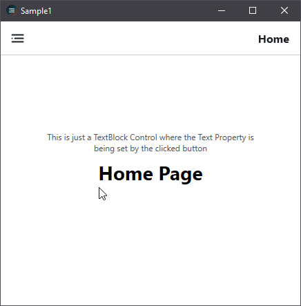
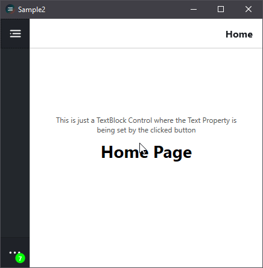
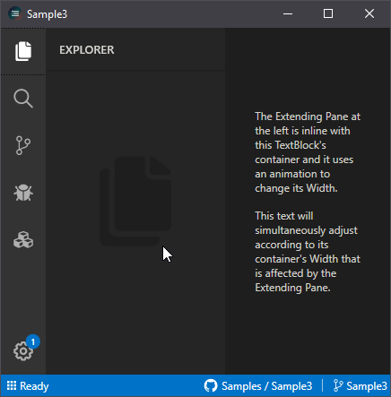
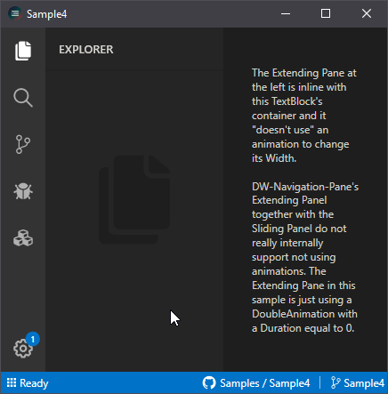

    
    <h1> DW Navigation Pane v2.0.2</h1>
    
 A framework for modern navigation panes and its items for making a better UI for WPF applications. 

    
 Supporting WPF .NET Framework (4.5.2+) 

 

 DW Navigation Pane offers a set of customizable panes and items to make the construction of navigation panels and bars easier.

## Visit the following for more information:
 * [DW Navigation Pane Wiki](https://github.com/DaaWaan/DW-Navigation-Pane/wiki)
 * [Releases](https://github.com/DaaWaan/DW-Navigation-Pane/releases)
 * [NuGet package](https://www.nuget.org/packages/DWNavigationPane/2.0.2)

  
## Samples

    
    &nbsp&nbsp&nbsp
    
    

    
    &nbsp&nbsp&nbsp
    

 
<h2> Limitations for general use (as of v2.0.2): </h2>
<ul>
    <li> Icons  —  Only icons from MahApps.Metro.IconPacks are currently supported. This will be resolved in the next minor update </li>
    <li> Ready-to-use Animated Navigation Bars  —  Only animated panels are currently provided. It is currently possible however to manually create animated navigation bars using the AnimatedPane class. This will be resolved in the next minor update. </li>
</ul>
