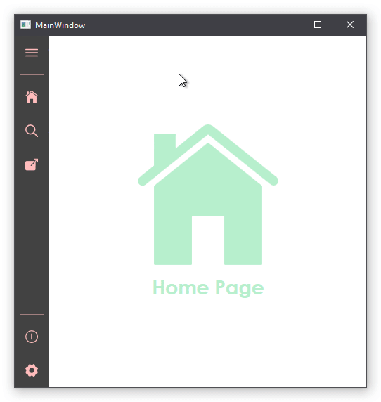

    <h1> MahApps.Metro-based NavigationPane </h1>
    
 A Navigation Pane that implements MahApps Metro Controls and Icon Pack. 

    
 Supporting WPF .NET Framework (4.5+)

 

 This custom control was made for my personal use for projects as an alternative to the MahApps Metro Hamburger Menu. 
    The official MahApps Metro Hamburger Menu currently doesn't have an animation for extending so I made this custom control instead.
    I don't have much time to learn how to contribute to the official MahApps.Metro in the meantime to add functionality for the Hamburger Menu control. 
    Feel free to contribute to this repository!

    

 
<h2> Features: </h2>
<ul>
    <li> Animated extension  —  includes adjustable compact & extended width </li>
    <li> MVVM-Support for binding pane items to collections </li>
    <li> Tooltips </li>
</ul>

<h2> Notice of Non-Affiliation and Disclaimer </h2>

 
    This control is not affiliated, associated, authorized, endorsed by, or in any way officially connected with MahApps, or any of its subsidiaries or its affiliates. 
    The official MahApps.Metro repository can be found at
    <a href="https://github.com/MahApps/MahApps.Metro">
        MahApps.Metro
    </a>

